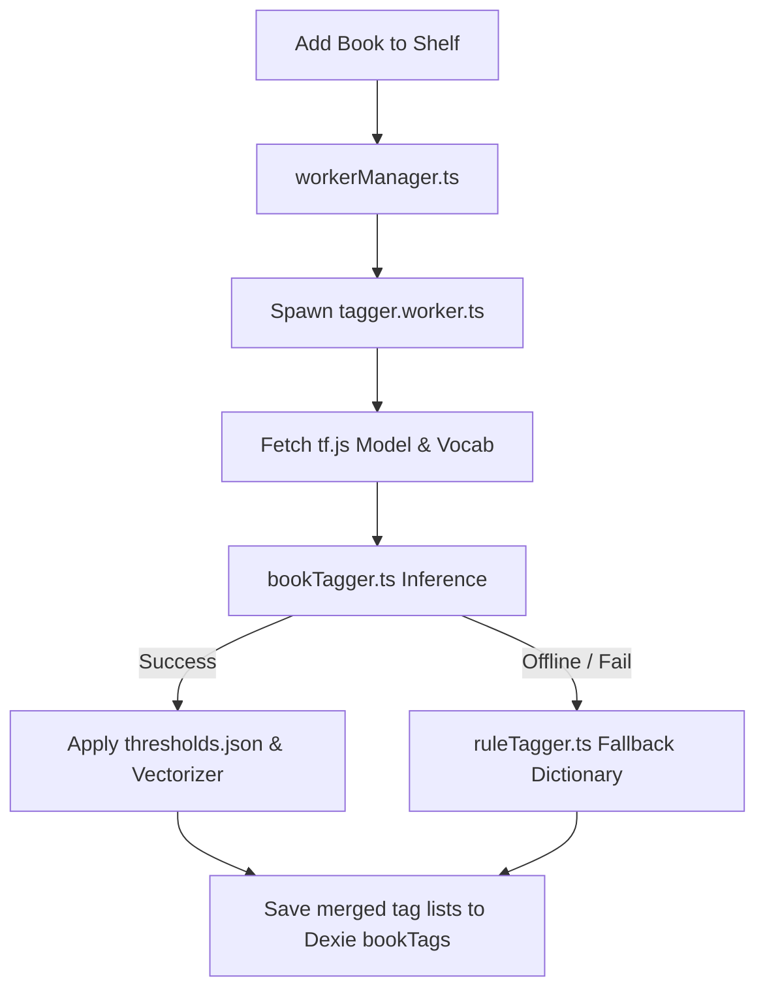

# Shelf — Project Context & Architecture Documentation

This document serves as the complete, detailed technical context for the **Shelf** Progressive Web App (PWA). If you are an AI assistant or a developer returning to modify or expand this application, this guide outlines the database schema, folder structure, ML categorization engine, PDF reader logic, SVG stats charts, and build procedures.

---

## 1. Project Overview & Constraints

**Shelf** is a client-side personal book companion PWA designed to run entirely in the browser with **zero backend dependencies and zero server costs**, making it deployable on static hosting services like **GitHub Pages**.

### Key Architectural Constraints:
- **Local-First Data Ownership**: All user library records (shelves, logs, ratings, notes, and PDF blobs) are stored in the browser's IndexedDB via Dexie.js. Data backups can be exported/imported as lightweight JSON (binary PDF blobs are excluded during backups to prevent browser download exhaustion).
- **Static Assets Host**: The application uses React, TypeScript, and Vite. Routing is hash-based (`/#/...`) to prevent 404 navigation failures on static directory servers. All asset URLs use base-relative paths (`import.meta.env.BASE_URL`).
- **Offline Capabilities**: In-browser machine learning running on Web Workers and an offline-first Service Worker ensure the app functions completely without internet connectivity.

---

## 2. File Structure Directory

Below is the directory mapping of the key source files in the project:

- **Routing & Base Shell**:
  - [src/App.tsx](file:///c:/Gemini%20Antigravity/BookShelf/src/App.tsx): Main router configuration defining layout mappings and routes (`/`, `/search`, `/book/*`, `/shelf`, `/shelf/:shelfId`, `/discover`, `/reader`, `/tags`, `/settings`).
  - [src/main.tsx](file:///c:/Gemini%20Antigravity/BookShelf/src/main.tsx): Root mounting file that registers the PWA Service Worker.
  - [src/components/Layout.tsx](file:///c:/Gemini%20Antigravity/BookShelf/src/components/Layout.tsx): Sidebar (desktop) and bottom-bar (mobile) navigation framework.
  - [index.html](file:///c:/Gemini%20Antigravity/BookShelf/index.html): HTML entry point loading Google fonts and the PDF.js script.

- **Pages**:
  - [src/pages/Home.tsx](file:///c:/Gemini%20Antigravity/BookShelf/src/pages/Home.tsx): Greeting dashboard routing portal.
  - [src/pages/Search.tsx](file:///c:/Gemini%20Antigravity/BookShelf/src/pages/Search.tsx): Open Library REST API query screen with local caching.
  - [src/pages/BookDetail.tsx](file:///c:/Gemini%20Antigravity/BookShelf/src/pages/BookDetail.tsx): Detailed book metadata viewer, smart tags editor, reading dates logs, and PDF companion upload widget.
  - [src/pages/Shelf.tsx](file:///c:/Gemini%20Antigravity/BookShelf/src/pages/Shelf.tsx): Shelf dashboard displaying system rows, custom list managers, and statistical averages.
  - [src/pages/ShelfDetail.tsx](file:///c:/Gemini%20Antigravity/BookShelf/src/pages/ShelfDetail.tsx): List/Grid toggler for shelf items with sorting dropdowns and filter sheets.
  - [src/pages/MoodDiscovery.tsx](file:///c:/Gemini%20Antigravity/BookShelf/src/pages/MoodDiscovery.tsx): Vibe matcher, daily recommendations, streak tracker, and Year in Review charts.
  - [src/pages/Reader.tsx](file:///c:/Gemini%20Antigravity/BookShelf/src/pages/Reader.tsx): Client-side PDF reader parsing text canvases, outlines, and page bookmarks.
  - [src/pages/TagBrowser.tsx](file:///c:/Gemini%20Antigravity/BookShelf/src/pages/TagBrowser.tsx): Cloud browser rendering tag distributions by font scaling.

- **Shared UI Components**:
  - [src/components/BookCard.tsx](file:///c:/Gemini%20Antigravity/BookShelf/src/components/BookCard.tsx): Aspect-ratio matched card displaying book details, status badges, and active PDF progress rings.
  - [src/components/StarRating.tsx](file:///c:/Gemini%20Antigravity/BookShelf/src/components/StarRating.tsx): Interactive half-star visual ratings picker.
  - [src/components/ContextMenu.tsx](file:///c:/Gemini%20Antigravity/BookShelf/src/components/ContextMenu.tsx): Desktop right-click / mobile tap-and-hold options card supporting inline shelf shifting, notes editing, and deletions.
  - [src/components/ShelfRow.tsx](file:///c:/Gemini%20Antigravity/BookShelf/src/components/ShelfRow.tsx): Reusable horizontal swipe strip for custom shelves.

- **Database, ML & Utilities**:
  - [src/db/schema.ts](file:///c:/Gemini%20Antigravity/BookShelf/src/db/schema.ts): Dexie IndexedDB schemas and system shelves seed scripts.
  - [src/ml/taxonomy.ts](file:///c:/Gemini%20Antigravity/BookShelf/src/ml/taxonomy.ts): Predefined 68 taxonomy tags.
  - [src/ml/workerManager.ts](file:///c:/Gemini%20Antigravity/BookShelf/src/ml/workerManager.ts): Main-thread worker controller piping summaries to TF.js.
  - [src/ml/tagger.worker.ts](file:///c:/Gemini%20Antigravity/BookShelf/src/ml/tagger.worker.ts): Multi-threaded inference script.
  - [src/ml/bookTagger.ts](file:///c:/Gemini%20Antigravity/BookShelf/src/ml/bookTagger.ts): TF-IDF calculations and model prediction thresholds.
  - [src/ml/ruleTagger.ts](file:///c:/Gemini%20Antigravity/BookShelf/src/ml/ruleTagger.ts): Local dictionary-matching offline fallback.
  - [src/utils/libraryBackup.ts](file:///c:/Gemini%20Antigravity/BookShelf/src/utils/libraryBackup.ts): JSON serialization utilities for library settings.
  - [public/sw.js](file:///c:/Gemini%20Antigravity/BookShelf/public/sw.js): Service Worker managing offline shell file assets.

---

## 3. Database Schema

IndexedDB is configured via [src/db/schema.ts](file:///c:/Gemini%20Antigravity/BookShelf/src/db/schema.ts) with Version `1`.

| Table | Key Index | Secondary Indexes | Description |
|---|---|---|---|
| `books` | `&workId` | `title, *authors, firstPublishYear, isbn` | Stores Open Library metadata and descriptions |
| `shelves` | `++id` | `name, isSystem, createdAt` | Defines system shelves ("Want to Read", "Reading", "Read") and custom list folders |
| `shelfBooks` | `++id` | `[shelfId+bookId], shelfId, bookId, addedAt, rating, startedAt, finishedAt` | Maps books to shelves. Stores ratings, read dates, and notes |
| `bookTags` | `++id` | `bookId, *tags, updatedAt` | Holds output ML tags alongside user-specified overrides |
| `readingSessions` | `++id` | `bookId, date, pagesRead` | Tracks daily page counts for reading streaks and heatmaps |
| `pdfFiles` | `&bookId` | `fileName, storedAt, totalPages, lastPage, bookmarks` | Stores PDF array blobs, outlines, page memory, and bookmarks |

---

## 4. Machine Learning Tagging Architecture

To avoid expensive API calls, **Shelf** uses in-browser neural networks running on a multi-threaded configuration.



### Components:
- **Taxonomy Categories**:
  - `mood`: 15 tags (e.g. *Cozy*, *Dark & Gritty*, *Uplifting*).
  - `pace`: 4 tags (*Slow Burn*, *Fast-Paced*, *Balanced*, *Episodic*).
  - `setting`: 11 tags (e.g. *Contemporary*, *Fantasy World*).
  - `theme`: 18 tags (e.g. *Coming of Age*, *Grief & Loss*).
  - `genre`: 20 tags (e.g. *Science Fiction*, *Mystery*).
- **Tagger Worker**: Spawns [src/ml/tagger.worker.ts](file:///c:/Gemini%20Antigravity/BookShelf/src/ml/tagger.worker.ts) using Vite's `?worker` syntax, which performs tokenisation, stopword filtering, bigram compilation, TF-IDF calculation, and network prediction outputs entirely off the main thread.
- **Threshold Optimization**: Model evaluations apply custom thresholds specified in `public/models/thresholds.json` to prevent label hallucination. If no matches pass threshold bounds, [src/ml/ruleTagger.ts](file:///c:/Gemini%20Antigravity/BookShelf/src/ml/ruleTagger.ts) triggers keyword-dictionary extraction, guaranteeing at least one fallback genre (e.g. *Literary Fiction*).

---

## 5. Interactive PDF Reader Engine

[src/pages/Reader.tsx](file:///c:/Gemini%20Antigravity/BookShelf/src/pages/Reader.tsx) provides client-side PDF document loading, canvas rendering, outlines parsing, and bookmarks.

### Reading Session delta updates (Streak Sync):
To keep reading streaks active without duplicate page counters, the reader tracks unique page flips using a state Set. The delta writes incremental changes to the database:
```typescript
const delta = pagesReadInSession.size - lastSessionSizeRef.current;
if (delta > 0) {
  // Update or insert into db.readingSessions for today's date
  lastSessionSizeRef.current = pagesReadInSession.size;
}
```

### Components:
- **CDN Libraries**: PDF.js script files (`pdf.min.js` and `pdf.worker.min.js`) are loaded from `cdnjs.cloudflare.com` to prevent Vite assembly and worker-packaging conflicts.
- **Canvas Rendering**: Viewports dynamically recalculate sizes using the parent container widths and zoom scale levels. Canvas rendering executes asynchronously under React page cycles.
- **Metadata Update**: If the book record has empty or null page counts, the reader automatically updates the metadata counts inside the `books` table using the loaded `pdf.numPages` total count.
- **Navigation Outlines**: PDF outlines (bookmarks) parse hierarchical nodes and fetch relative page index references by calling `pdf.getPageIndex(ref)`.

---

## 6. Mood Discovery & Year in Review Visual Stats

[src/pages/MoodDiscovery.tsx](file:///c:/Gemini%20Antigravity/BookShelf/src/pages/MoodDiscovery.tsx) houses calculations for library matching, streaks, and SVG statistics.

### Components:
- **Vibe Matcher Math**: User selects between 1 and 3 mood tags. Matching calculates intersecting lists:
  $$\text{Match Score} = \frac{|\text{Selected Moods} \cap \text{Book Tags}|}{|\text{Selected Moods}|}$$
  Matching books display percentage pills and order by Match Score desc, Rating desc, and Title.
- **Streaks System**:
  Unique dates from `db.readingSessions` sort chronologically. The tracker checks if the latest entry aligns with today or yesterday, calculating consecutive segments backward. Segments are cached in `localStorage` but verified dynamically from database records.
- **SVG Charts**:
  - **Reading Goal Tracker**: Circular SVG gauge mapping completed books to annual target numbers.
  - **Books by Month Chart**: Dynamic SVG vertical bar layout aligning finished books to monthly periods.
  - **Reading Heatmap**: GitHub contribution style grid mapping `db.readingSessions` output logs to 53 columns (weeks) by 7 rows (days). Cells light up in shades of gold/sage depending on the page count threshold (0, 1-20, 21-50, 51-100, 100+ pages read).

---

## 7. PWA Setup & Service Worker Cache Strategy

- **Service Worker Location**: Located in [public/sw.js](file:///c:/Gemini%20Antigravity/BookShelf/public/sw.js). Placing it in the public folder allows it to be compiled to the root (`dist/sw.js`), permitting scope control over the entire `/shelf/` sub-directories paths.
- **Caching Mechanism**:
  - **Pre-Cache Shell**: Pre-caches `index.html`, `manifest.json`, local icons, Google fonts, and the PDF.js scripts.
  - **Dynamic Cache**: Intercepts requests, applying **Cache-First** fetch strategies to local assets, CDNs, and TF.js model parameters. Serves static files immediately and executes background updates (Stale-While-Revalidate).
  - **Network Exclusions**: Open Library API requests are bypassed to allow database TTL caches to handle metadata searches dynamically.
- **Main Setup Registration**: Mounts in [src/main.tsx](file:///c:/Gemini%20Antigravity/BookShelf/src/main.tsx) using the base environment directory:
  `navigator.serviceWorker.register(`${import.meta.env.BASE_URL}sw.js`)`

---

## 8. Build & Development Commands

### Paths & Runtime Environment
- **Node Workspace**: Utilizing Node version `22.12.0` located locally inside `c:\Gemini Antigravity\BookShelf\.node`.
- **PowerShell Exec Execution**: PowerShell execution policies block script aliases. Run commands prefixing execution variables and targeting `.cmd` aliases directly.

### Running Commands:
- **Local Dev Server**:
  ```powershell
  $env:PATH = 'c:\Gemini Antigravity\BookShelf\.node;' + $env:PATH; npm.cmd run dev
  ```
- **Build Compilation Check**:
  ```powershell
  $env:PATH = 'c:\Gemini Antigravity\BookShelf\.node;' + $env:PATH; npm.cmd run build
  ```
- **Lint Check**:
  ```powershell
  $env:PATH = 'c:\Gemini Antigravity\BookShelf\.node;' + $env:PATH; npm.cmd run lint
  ```
